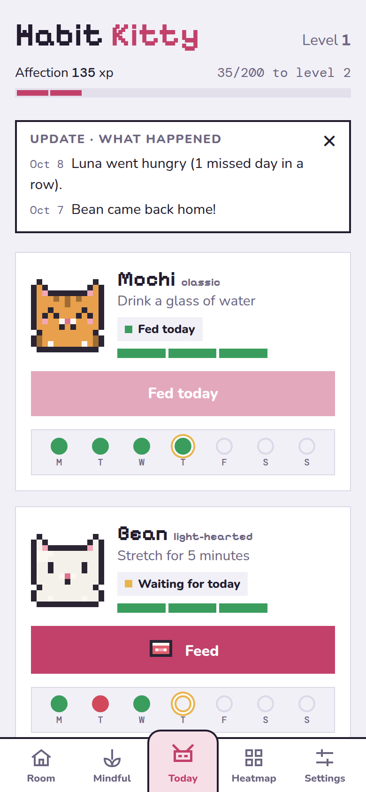
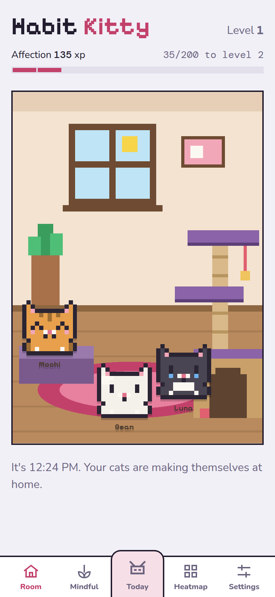
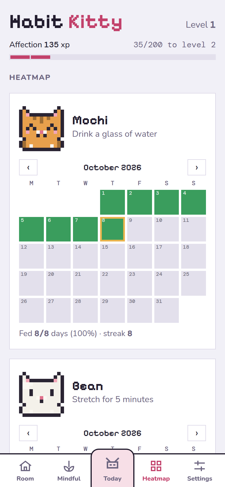
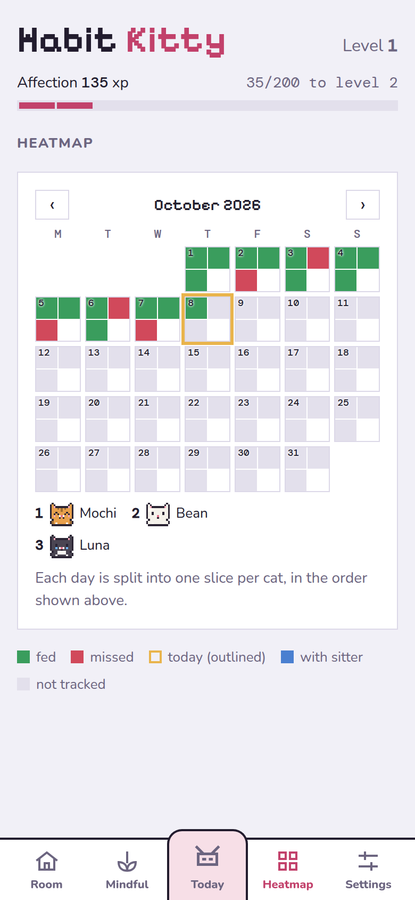
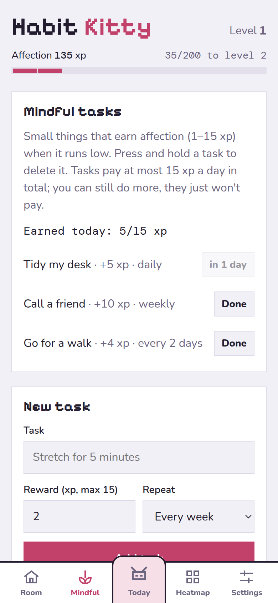
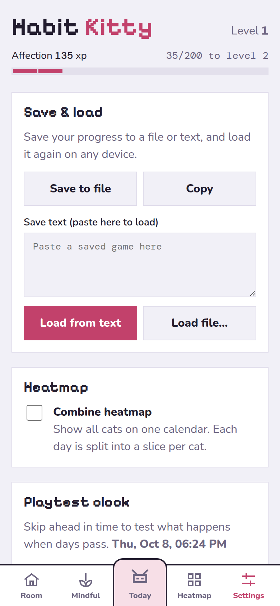
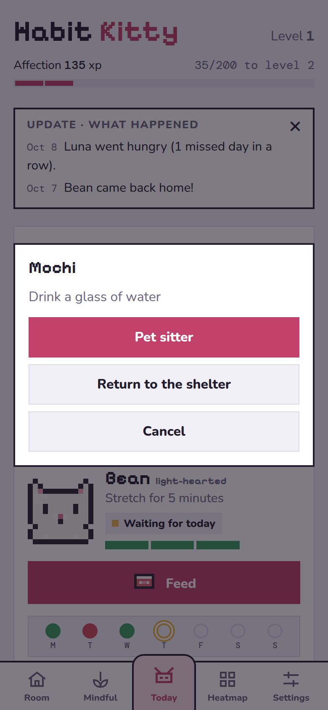
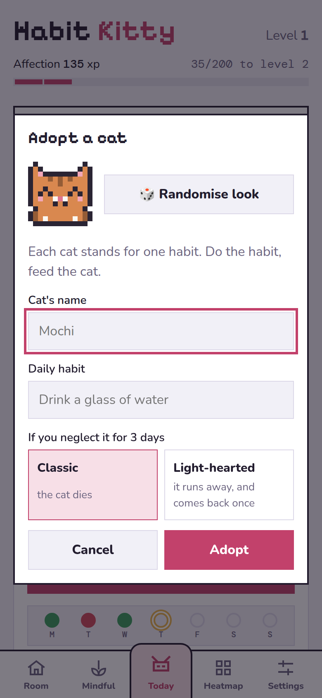

# Habit Kitty

A habit tracker where every habit is a pixel cat. Do the habit, feed the cat. Skip it and the cat goes hungry.
Runs as a single web page and as an offline Android app (via Capacitor).

| Today | Room | Heatmap | Combined heatmap |
|:--:|:--:|:--:|:--:|
|  |  |  |  |

| Mindful tasks | Settings | Press and hold a cat | Adopt a cat |
|:--:|:--:|:--:|:--:|
|  |  |  |  |

## How it works

- Each cat stands for one habit. Feed it once a day for **+5 affection**. A day runs from **2am to 2am**.
- Every missed day costs **−15**. After 3 missed days in a row a *classic* cat **dies** (affection resets to 0);
  a *light-hearted* one **runs away** and can be won back once.
- Going away? Press and hold a cat to leave it with the **pet sitter** for up to 7 days
  (−5 a day, once every 30 days). Bring it home in time or it stays there.
- No longer want a habit? Press and hold the cat and **return it to the shelter**, with no penalty.
- Below 0 affection, cats only trust you with one cat at a time.
- **Mindful tasks** are small repeatable chores (daily, weekly, custom) that earn affection back.
  They pay at most 15 xp a day in total; you can still do more, they just won't pay.
- Every cat gets a different food each day (kibbles, wet food, fish, chicken, shrimp or meat).
  Each cat has its own look, which you can randomise when adopting.

## Tabs

1. **Room**: a cosy room that follows the clock. Awake cats wander and climb the cat tree, and sleep at night.
   Double-tap an awake cat for a heart. Cats with the sitter are away from home.
2. **Mindful**: your repeatable tasks. Press and hold one to delete it.
3. **Today**: your cats, this week as dots, and the update box.
4. **Heatmap**: the month for each cat, or all cats on one calendar (turn on *Combine heatmap* in Settings).
5. **Settings**: save and load, combined heatmap, playtest clock and how to use.

Progress is stored on the device. Use **Settings → Save & load** to back it up (on Android, *Save to file*
opens the share sheet) or move it to another device.

## Development

Requires Node 22+.

```sh
npm install
npm test                # rules engine tests (vitest)
npm run build:web       # bundle the page to dist/habit-kitty.html and app-www/index.html
npm run play            # play the rules engine in the terminal
```

### Android app

Requires Android Studio (for the SDK and its bundled JDK).

```sh
npm run app:sync        # build the page and copy it into the Android project
npm run app:apk         # clean build, then copy the debug APK to dist/HabitKitty.apk
adb install -r dist/HabitKitty.apk
```

You can also open the `android/` folder in Android Studio and press Run after `npm run app:sync`.

### Project layout

| Path | What it is |
|---|---|
| `src/rules.ts` | Game rules: feeding, starvation, sitter, shelter, mindful tasks, levels. Pure functions, no UI. |
| `src/calendar.ts` | Week and month data for the dots and heatmaps. |
| `src/web/app.ts` | The UI: tabs, pixel sprites, room, dialogs, save and load. |
| `web/page.html` | Page markup and styles. |
| `web/build.js` | Bundles the page for the web and for the Android app. |
| `src/play.ts` | Terminal playground for the rules. |
| `android/` | Capacitor Android project. |

Build output (`dist/`, `app-www/`, the APK) and local files (`save.json`, `node_modules/`) are git-ignored.

### Playtesting time

**Settings → Playtest clock** skips ahead 3 hours or a day so you can see hunger, the sitter and cat deaths
without waiting. Tap **Now** to go back to real time; the skipped days still count.
