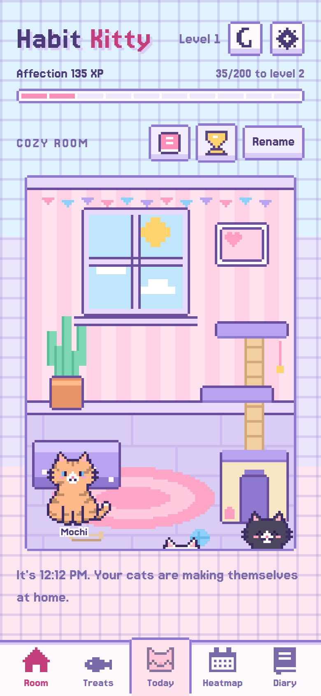
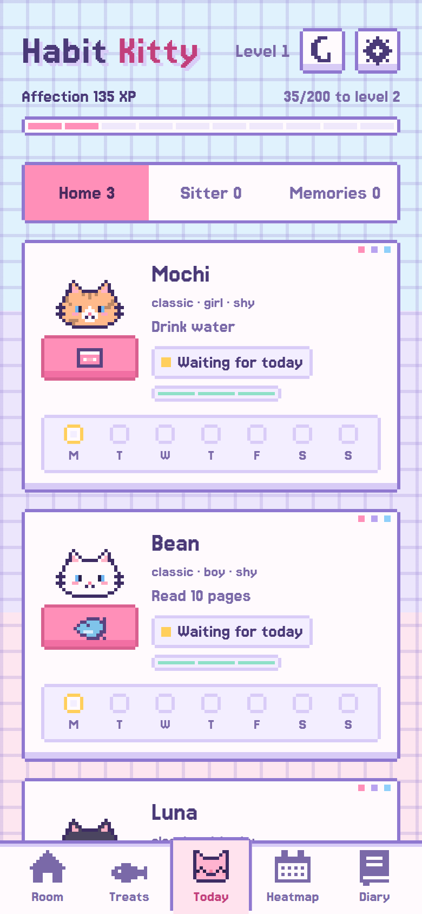
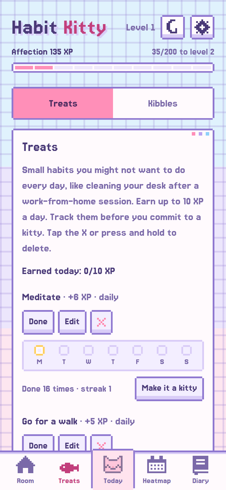
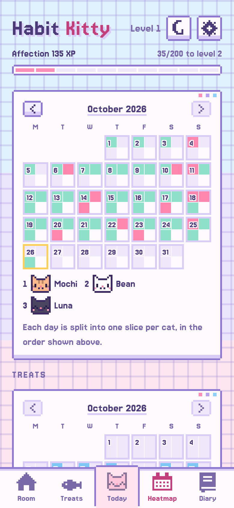
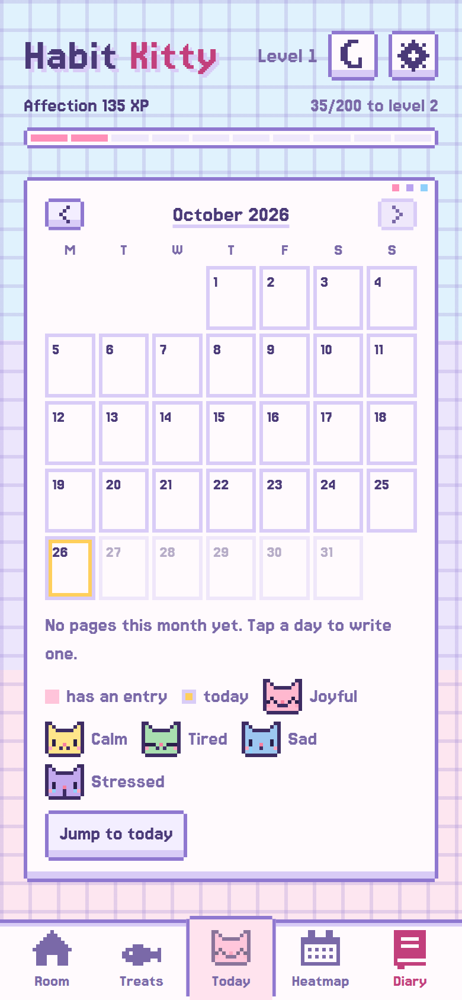

# Habit Kitty

A habit tracker where every habit is a pixel cat. Do the habit, feed the cat. Skip it and the cat goes hungry.
It lives in a cozy pastel pixel world (pink, baby blue and lavender, with a pixel grid behind everything) and runs as a
single web page and as an offline Android app (via Capacitor).

| Room | Today | Treats | Heatmap | Diary |
|:--:|:--:|:--:|:--:|:--:|
|  |  |  |  |  |

## How it works

- Each cat stands for one habit. Feed it once a day for **+5 affection**. A day runs from **2am to 2am** by default; you can move its start (up to noon) in Settings → Your day.
- Every missed day costs **−15**. After 3 missed days in a row a *classic* cat **dies** (affection resets to 0);
  a *light-hearted* one **runs away** and can be won back once.
- Going away? Press and hold a cat to leave it with the **pet sitter** for up to 7 days
  (−5 a day, once every 30 days). Bring it home in time or it stays there.
- No longer want a habit? Press and hold the cat and **return it to the shelter**, with no penalty.
- Below 0 affection, cats only trust you with one cat at a time.
- You can keep up to **9 kitties**. From the 6th the app nags you to be responsible, and the 10th is blocked.
  **Settings → Unlimited kitty** lifts the limit, but every extra kitty needs three different "are you sure?" dialogs.
- **Treats** are one-off jobs worth up to 15 XP. Do them once, tick them off.
- **Stray kitties** (mindful habits) repeat (daily, weekly, custom) and keep a history, worth up to 10 XP a day. You feed a stray by doing its habit,
  and nothing bad happens when you skip a day. A daily stray can be **adopted** as a kitty: it keeps its history, shown in teal.
- Changed your mind? Press and hold a kitty, then **Release to the stray colony**: it becomes a daily stray again, with no penalty, and can be adopted back as the same kitty.
- Treats and strays can always be done, but each kind pays out at most its cap per day.
- Everything is drawn on one pixel grid, so kitties, icons, food and the room share a single pixel size.
- Every cat gets a different food each day (dry food, wet food, fish, chicken, shrimp or meat).
  Each cat has its own look, which you can randomise when adopting.

- Every kitty is a girl or a boy (chosen when you adopt). Feeding earns a warm message, with special ones for first meals, streaks and milestones.
- **Achievements** (trophy in the Room): meals served, weeks of raising kitties, streaks, strays fed and treats done, levels, diary pages.
- **Kitty diary** (book in the Room): what all your kitties got up to, day by day. Press and hold one kitty for its own.
- **Time travel** (Settings → Game options): mark or unmark stray kitties and treats as done on any past day. Edits the record only, no XP.
- Reminders mention the habit, and on Android the notification icon is the kitty's face in its mood and fur colour
  (`npm run icons` redraws them after changing the pixel cats).
- **Sound** (Settings → Sound): background music, kitties meowing in the room, and purrs or meows when you pet one. Each has its own volume.
- See [CHANGELOG.md](CHANGELOG.md). The app shows what's new once after an update, and lists it in Settings → Change log.

## Tabs

1. **Room**: a cosy room that follows the clock. Awake cats wander and climb the cat tree, and sleep at night.
   Double-tap an awake cat for a heart. Cats with the sitter are away from home.
   Switch to the **Garden** to meet your strays: a stray that is due to be fed today turns up with an 80% chance, and the others with 30%, every 6 hours. A stray you feed in the garden has a 50% chance of wandering off again. Press and hold one for its menu.
2. **Strays**: switch between repeating **Stray kitties** (habits) and one-off **Treats**. Press and hold a stray for its menu (heatmap, adopt, rename, delete), or a treat to delete it.
3. **Today**: your cats, sorted into **Home**, **Sitter** and **Memories** (cats that died, ran away or went to the shelter, each with a condensed all-time heatmap from adoption to departure). Press and hold a cat for the sitter, its heatmap or the shelter.
4. **Heatmap**: a switch toggles between all kitties on one calendar (each day split into a slice per kitty) and one calendar per kitty. Stray kitties are listed below. Dead and runaway cats are not shown.
5. **Diary**: a monthly calendar. Tap a day to write a page, pick a mood (a little pixel cat) and attach a photo from your gallery.
   Days with a page turn pink and the mood shows inside the day. Photos are shrunk to at most 60 KB (900 px on the long side) and kept on the device (not in saved text).

**Settings** is the gear icon at the top right, next to the light/dark switch. It holds feeding reminders, your day start, sound, save and load, unlimited kitty, and how to use.

### Feeding reminders

Settings → Feeding reminders sends one notification a day at the time you pick (local time, follows time zone changes
whenever the app opens). A kitty that hasn't been fed today is named at random ("Mochi is hungry! Can you feed them?"),
not the same one two days running if others are hungry; if everyone is fed you get "All cats are fed and happy!".
Reminders are Android local notifications (permission asked when you switch it on), re-planned for 14 days ahead on every
app open and every change, with one id per date so they never duplicate, and they survive restarts and reboots.
In a browser they only fire while the page is open.

### Thoughts

In the room, a cat at home sometimes thinks of one that is with the sitter (more often the longer it is away), and rarely of
cats that passed away, ran away or recently came home. One bubble at a time, with rests between them, and always based on
the cat's current status.

Progress is stored on the device. Use **Settings → Save & load** to back it up (on Android, *Save to file*
opens the share sheet) or move it to another device.

## Development

Requires Node 22+.

```sh
npm install
npm test                # rules engine tests (vitest)
npm run build:web       # bundle the page to dist/habit-kitty.html and app-www/index.html
npm run play            # play the rules engine in the terminal
npm run preview         # live sprite sheet of the pixel cats (reloads on every edit)
npm run editor          # pixel editor for the cat art and coat patterns
```

### Android app

Requires Android Studio (for the SDK and its bundled JDK). `npm run app:apk` uses `$JAVA_HOME` if it is set, and otherwise
falls back to a JDK path on the author's machine, so set `JAVA_HOME` to your JDK (for example Android Studio's `jbr` folder) first.

```sh
npm run app:sync        # build the page and copy it into the Android project
npm run app:apk         # clean build, then copy the debug APK to dist/HabitKitty.apk
adb install -r dist/HabitKitty.apk
```

You can also open the `android/` folder in Android Studio and press Run after `npm run app:sync`.

### Project layout

| Path | What it is |
|---|---|
| `src/rules.ts` | Game rules: feeding, starvation, sitter, shelter, mindful tasks, levels. Pure functions, no UI. |
| `src/calendar.ts` | Week and month data for the dots and heatmaps. |
| `src/store.ts` | Save format: game, diary pages and photos, and packing them into a `.kitty` backup. |
| `src/achievements.ts` | Achievements, worked out from the save. |
| `src/catdiary.ts` | Each cat's own diary of little happenings (pure, seeded). |
| `src/reminders.ts` | What each daily reminder says and when (pure, tested). |
| `src/thoughts.ts` | Who a cat thinks about, and how often (pure, tested). |
| `src/pixelart.ts` | The shared pixel grid, pastel palette, icons, food and room art (pure, returns SVG). |
| `src/pixelcat.ts`, `src/coats.ts` | The pixel cats and the per-coat pattern layers (edit them with `npm run editor`). |
| `src/web/app.ts` | The UI: tabs, pixel sprites, room, dialogs, save and load. |
| `web/page.html` | Page markup and styles. |
| `web/build.js` | Bundles the page, font and sounds for the web and for the Android app. |
| `web/editor.js`, `web/pixel-editor.html` | The pixel editor for the cat art. |
| `web/preview.js`, `src/web/preview.ts` | Live sprite sheet for `npm run preview` (dev only). |
| `scripts/notify-icons.ts` | Draws the Android notification icons (`npm run icons`). |
| `sounds/` | Background music, meow and purr. |
| `src/play.ts` | Terminal playground for the rules. |
| `android/` | Capacitor Android project. |

Build output (`dist/`, `app-www/`, the APK) and local files (`save.json`, `node_modules/`) are git-ignored.

### Playtesting time

**Settings → Playtest clock** skips ahead 3 hours or a day so you can see hunger, the sitter and cat deaths
without waiting. Tap **Now** to go back to real time; the skipped days still count.

## Credits

- Background music: Strawberry Walk 【BGM： IchinoseSound】 https://www.youtube.com/@IchinoseSound
